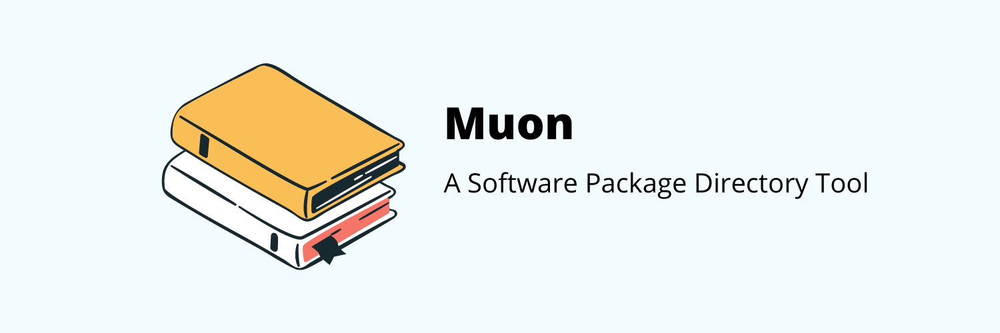

<br>

# Muon: A Software Project Manage Tool

<p>
  The muon is a software package directory tool. It helps find packages, modules, or libraries you can use for you software project.
</p>

<br>

## Install

First, clone the repo via git and install dependencies:

```bash
$ git clone --depth 1 --single-branch https://github.com/workpebojot/Muon.git your-project-name
$ cd your-project-name
$ npx yarn
```

## Starting Development

Start the app in the `dev` environment:

```bash
$ npx yarn start
```

## Packaging for Production

To package apps for the local platform:

```bash
$ npx yarn package
```

## License

MIT © [Muon](https://github.com/workpebojot/Muon)
